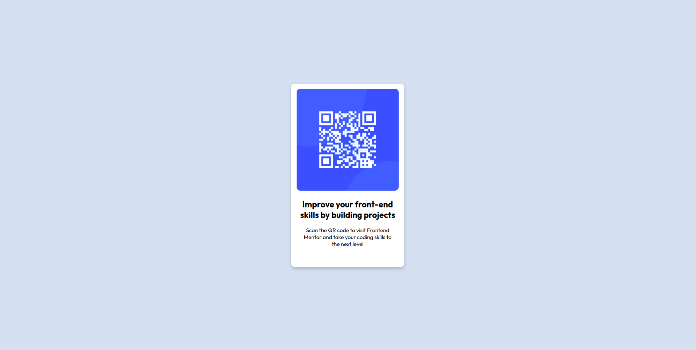

# Frontend Mentor - QR code component solution

This is a solution to the [QR code component challenge on Frontend Mentor](https://www.frontendmentor.io/challenges/qr-code-component-iux_sIO_H). Frontend Mentor challenges help you improve your coding skills by building realistic projects. 

## Table of contents

- [Overview](#overview)
  - [Screenshot](#screenshot)
  - [Links](#links)
- [My process](#my-process)
  - [Built with](#built-with)
  - [What I learned](#what-i-learned)
  - [Useful resources](#useful-resources)
- [Author](#author)

## Overview

### Screenshot




### Links

- Solution URL: [Add solution URL here](https://your-solution-url.com)
- Live Site URL: [Add live site URL here](https://your-live-site-url.com)

## My process

### Built with

- Semantic HTML5 markup
- CSS custom properties
- Flexbox

### What I learned

Here I learnt how to make proper use of flex containers, tools and its properties such as justify-content, align-items, flex-direction.
Also learnt about adding Shadow to my main box.

```css
.body-box{
    background: hsl(0, 0%, 100%);
    height: 325px;
    width: 210px;
    border-radius: 10px;
    display: flex;
    flex-direction: column;
    align-items: center;
    box-shadow: 0 5px 10px 0 rgba(0, 0, 0, 0.2);
}
```

### Useful resources

- [flexboxfroggy](https://flexboxfroggy.com) - This helped me to practice the flexbox skill and its properties. I really liked this pattern and will use it going forward.
- [Shadow_Box](https://www.w3schools.com/css/css3_shadows_box.asp) - This is an amazing article on box-shadow.


## Author

- Hashnode Blog - [Indrajit Mandal](https://jitm25.hashnode.dev/)
- Frontend Mentor - [@Jitmandal051004](https://www.frontendmentor.io/profile/Jitmandal051004)
- Twitter - [@mandal24_jit](https://twitter.com/mandal24_jit)

